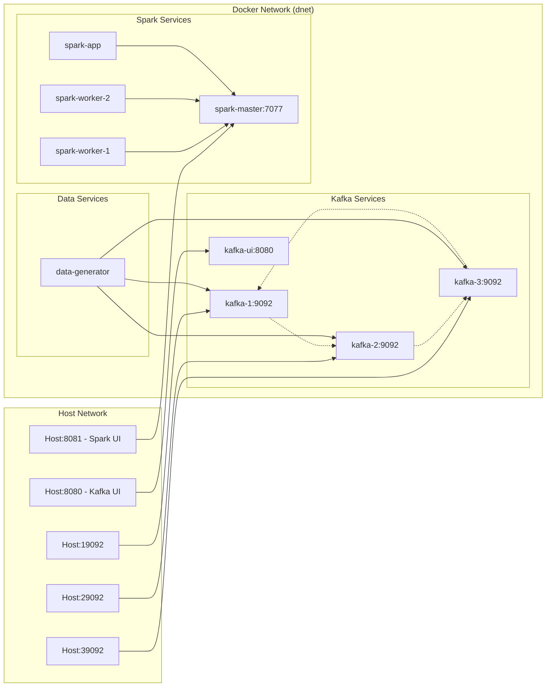

# 🏗️ Mini Cluster Setup - System Architecture

## High-Level System Design

This document provides a comprehensive overview of the Mini Cluster Setup architecture, illustrating the data flow, component interactions, and technology stack.

## 📑 Table of Contents
- [📊 Architecture Diagram](#-architecture-diagram) - Main system overview with Mermaid diagrams
- [🔧 Component Details](#-component-details) - Detailed component specifications
- [📈 Data Flow](#-data-flow) - Sequence diagrams showing temporal flow
- [🛠️ Technology Stack](#️-technology-stack) - Complete technology breakdown
- [🚀 Key Features](#-key-features) - Performance, fault tolerance, and scalability
- [🔍 Network Topology](#-network-topology) - Docker network and connectivity

## 📊 Architecture Diagram

```mermaid
flowchart TB
    %% Styles with black text
    classDef kafkaNode fill:#e1f5fe,stroke:#01579b,stroke-width:2px,color:#000000
    classDef sparkNode fill:#f3e5f5,stroke:#4a148c,stroke-width:2px,color:#000000
    classDef dataNode fill:#e8f5e8,stroke:#1b5e20,stroke-width:2px,color:#000000
    classDef monitorNode fill:#fff3e0,stroke:#e65100,stroke-width:2px,color:#000000
    classDef configNode fill:#fce4ec,stroke:#880e4f,stroke-width:2px,color:#000000

    %% Data Generation Layer
    subgraph Data Generation Layer
        DG[🔥 High-Performance Data Generator<br/>Multi-threaded Producer<br/>LZ4 Compression<br/>Batch Processing]
    end

    %% Message Streaming Infrastructure
    subgraph Message Streaming Infrastructure
        subgraph Kafka Cluster KRaft Mode
            K1[🟢 Kafka Broker 1<br/>Port: 19092]
            K2[🟢 Kafka Broker 2<br/>Port: 29092] 
            K3[🟢 Kafka Broker 3<br/>Port: 39092]
        end
        
        subgraph Topics
            CT[📝 Clickstream Topic<br/>User Interactions]
            IT[🌡️ IoT Topic<br/>Sensor Data]
        end
    end

    %% Stream Processing Layer
    subgraph Stream Processing Layer
        subgraph Spark Cluster
            SM[⚡ Spark Master<br/>Resource Manager<br/>Job Scheduler]
            SW1[🔷 Spark Worker 1<br/>Data Processing]
            SW2[🔷 Spark Worker 2<br/>Data Processing]
        end
        
        SE[🔄 Streaming ETL Job<br/>Real-time Processing<br/>Watermarking<br/>Deduplication]
    end

    %% Data Storage Layer
    subgraph Data Storage Layer
        subgraph Persistent Storage
            DL[🗃️ Data Lake<br/>./data/datalake/<br/>Parquet Format<br/>Date Partitioned]
            CP[💾 Checkpoints<br/>./data/checkpoints/<br/>Fault Tolerance<br/>Streaming State]
        end
        
        subgraph Processed Tables
            CT_TABLE[📊 Clickstream Table<br/>event_id, user_id, url, ts]
            IOT_TABLE[🌡️ IoT Table<br/>device_id, temp, humidity, ts]
            AGG_TABLE[📈 Aggregations Table<br/>Page views per minute]
        end
    end

    %% Monitoring and Analytics Layer
    subgraph Monitoring and Analytics Layer
        KUI[🖥️ Kafka UI<br/>Port: 8080<br/>Topic Management<br/>Message Browser]
        SUI[📊 Spark UI<br/>Port: 8081<br/>Job Monitoring<br/>Performance Metrics]
        JN[📓 Jupyter Notebook<br/>Data Analysis<br/>Visualizations<br/>Interactive Exploration]
    end

    %% Configuration Management
    subgraph Configuration Management
        CONFIG[⚙️ YAML Configuration<br/>config.yml<br/>Centralized Settings]
        ENV[🔧 Environment Variables<br/>.env file<br/>Docker Compose]
    end

    %% Data Flow
    DG -->|Produces Events<br/>200+ events/sec| CT
    DG -->|Produces Events<br/>150+ events/sec| IT
    
    K1 -.-> CT
    K2 -.-> CT  
    K3 -.-> CT
    K1 -.-> IT
    K2 -.-> IT
    K3 -.-> IT

    CT -->|Stream Data| SE
    IT -->|Stream Data| SE
    
    SM -->|Manages| SW1
    SM -->|Manages| SW2
    SW1 -->|Executes| SE
    SW2 -->|Executes| SE
    
    SE -->|Writes Parquet| CT_TABLE
    SE -->|Writes Parquet| IOT_TABLE
    SE -->|Writes Parquet| AGG_TABLE
    
    CT_TABLE --> DL
    IOT_TABLE --> DL
    AGG_TABLE --> DL
    
    SE -.->|Checkpoints| CP
    
    %% Monitoring Connections
    K1 -.->|Metrics| KUI
    K2 -.->|Metrics| KUI
    K3 -.->|Metrics| KUI
    
    SM -.->|Metrics| SUI
    SW1 -.->|Metrics| SUI
    SW2 -.->|Metrics| SUI
    SE -.->|Job Status| SUI
    
    DL -->|Data Access| JN
    
    %% Configuration Flow
    CONFIG -->|Generates| ENV
    ENV -.->|Configures| K1
    ENV -.->|Configures| K2
    ENV -.->|Configures| K3
    ENV -.->|Configures| SM
    ENV -.->|Configures| DG

    %% Class assignments
    class K1,K2,K3,CT,IT,KUI kafkaNode
    class SM,SW1,SW2,SE,SUI sparkNode
    class DL,CP,CT_TABLE,IOT_TABLE,AGG_TABLE dataNode
    class JN monitorNode
    class CONFIG,ENV configNode
'''

## 🔧 Component Details

### **Data Generation Layer**
- **High-Performance Data Generator**: Multi-threaded Python application producing realistic events
- **Event Types**: Clickstream (user interactions) and IoT (sensor data)
- **Performance**: 200+ clickstream events/sec, 150+ IoT events/sec
- **Features**: LZ4 compression, batch processing, graceful shutdown

### **Message Streaming Infrastructure**
- **Kafka Cluster**: 3-node cluster running in KRaft mode (no ZooKeeper)
- **High Availability**: Replication factor 3, min in-sync replicas 2
- **External Access**: Ports 19092, 29092, 39092 for host connectivity
- **Topics**: `clickstream` and `iot` with configurable partitions

### **Stream Processing Layer**
- **Apache Spark**: Custom containers with optimized configurations
- **Streaming ETL**: Real-time processing with watermarking and deduplication
- **Fault Tolerance**: Checkpointing and exactly-once processing semantics
- **Scalability**: 1 master + 2 workers with configurable resources

### **Data Storage Layer**
- **Data Lake**: Bind-mounted storage with Parquet format
- **Partitioning**: Date-based partitioning (dt=YYYY-MM-DD)
- **Tables**: Clickstream events, IoT sensor data, aggregated analytics
- **Checkpoints**: Streaming state management for fault recovery

### **Monitoring & Analytics Layer**
- **Kafka UI**: Web interface for topic management and message browsing
- **Spark UI**: Job monitoring and performance metrics
- **Jupyter Analytics**: Interactive data exploration and visualization

### **Configuration Management**
- **YAML-First**: Central configuration with `config.yml`
- **Auto-Generation**: Converts YAML to environment variables
- **Fallback System**: Graceful degradation to environment variables

## 📈 Data Flow

```mermaid
sequenceDiagram
    participant DG as Data Generator
    participant KC as Kafka Cluster
    participant SE as Spark ETL
    participant DL as Data Lake
    participant JN as Jupyter Notebook

    Note over DG: Multi-threaded Production
    DG->>KC: Batch Events (LZ4 compressed)
    Note over KC: 3-node cluster<br/>High availability
    
    loop Real-time Processing
        KC->>SE: Stream Events
        Note over SE: Watermarking<br/>Deduplication<br/>Aggregation
        SE->>DL: Write Parquet Files
        SE->>SE: Checkpoint State
    end
    
    Note over DL: Date Partitioned<br/>Parquet Format
    DL->>JN: Data Analysis
    Note over JN: Interactive Exploration<br/>Visualizations
```

## 🛠️ Technology Stack

| **Layer** | **Technology** | **Purpose** |
|-----------|----------------|-------------|
| **Containerization** | Docker, Docker Compose | Service orchestration |
| **Message Streaming** | Apache Kafka 3.7 (KRaft) | Event streaming platform |
| **Stream Processing** | Apache Spark 3.5.1 | Real-time data processing |
| **Data Storage** | Parquet, Local filesystem | Columnar storage format |
| **Configuration** | YAML, Python ConfigLoader | Configuration management |
| **Monitoring** | Kafka UI, Spark UI | System monitoring |
| **Analytics** | Jupyter, Pandas, Matplotlib | Data analysis |
| **Data Generation** | Python, Faker, Confluent Kafka | Synthetic data production |

## 🚀 Key Features

### **High Performance**
- Multi-threaded data generation with batch processing
- LZ4 compression for optimal network utilization
- Configurable worker resources and parallelism

### **Fault Tolerance**
- Kafka replication and min in-sync replicas
- Spark checkpointing and exactly-once semantics
- Graceful shutdown with message flushing

### **Scalability**
- Horizontal scaling of Kafka brokers and Spark workers
- Partitioned topics for parallel processing
- Date-partitioned storage for efficient querying

### **Production Ready**
- YAML-based configuration management
- Comprehensive monitoring and alerting
- Data cleanup and management utilities

## 🔍 Network Topology



This architecture provides a robust, scalable, and production-ready data engineering platform suitable for real-time analytics, data science experimentation, and stream processing development.
